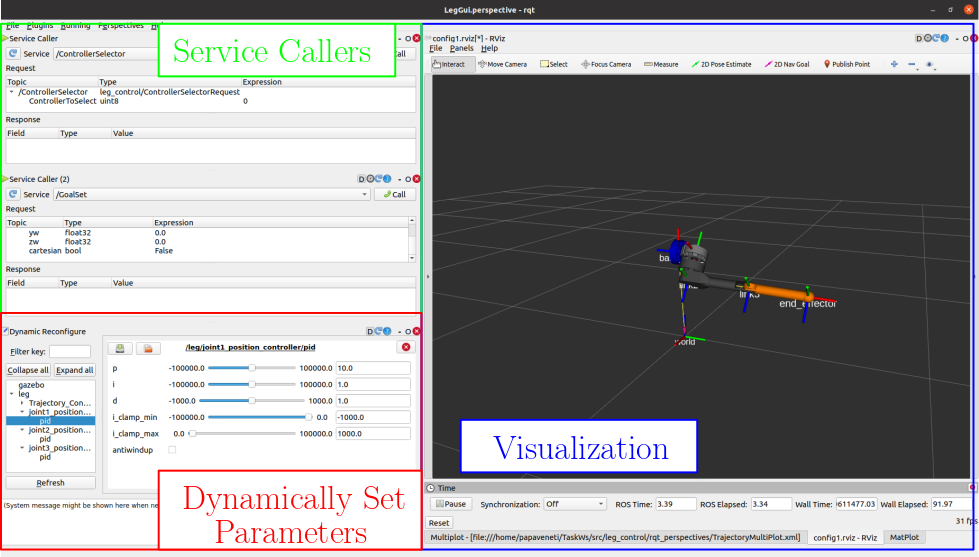

## Prerequisites:

The packages used by the controllers are the following:

1. [Eigen](http://eigen.tuxfamily.org/index.php?title=Main_Page), a C++ template library for linear algebra: matrices, vectors, numerical solvers, and related algorithms.

The required packages (Eigen) can be installed by executing the shell script install_packages.sh.

## Installation

* Make sure you have Ubuntu 20.04 installed and running. This framework was developed on ROS Noetic and Gazebo 11, so this version of Ubuntu is necessary.

* Download and install the Desktop-Full version of ROS Noetic, following the steps described [here](http://wiki.ros.org/noetic/Installation/Ubuntu). This version includes Gazebo 11 simulator.

* Install catkin tools. [catkin](https://wiki.ros.org/catkin) is the official build system of ROS to generate executables, libraries, and interfaces. Catkin Command Line Tools are used in order to build packages in the workspace. They can be installed in by following the instructions described [here](https://catkin-tools.readthedocs.io/en/latest/installing.html#installing-on-ubuntu-with-apt-get).

* Create a catkin environment. The process is described below: 

  1. Source the environment:

  `source /opt/ros/noetic/setup.bash`

  2. Create workspace:

  `mkdir -p ~/<your_workspace>/src`

  `cd ~/<your_workspace>`

  `catkin init`

  3. Save the contents of the repository in the src folder. 

  *  3a. Either directly download the contents (notice the `.` in the end of the second command.This doens't create a parent folder):

  `cd ~/<your_workspace>/src`

  `git clone https://MikePapas@bitbucket.org/csl_legged/legsimulation.git .`

  * 3b. Or download the to another folder, named `folder` and create a symlink the packages to src:  

  `cd ~/<folder>`

  `git clone https://MikePapas@bitbucket.org/csl_legged/legsimulation.git`

  `ln -s ~/<folder>/legsimulation/leg_description ~/<your_workspace>/src/`

  `ln -s ~/<folder>/legsimulation/leg_control ~/<your_workspace>/src/` 

## ROS & Gazebo
## Argos Leg model

The argos leg model in gazebo consists of the following packages:

#### **leg_description**

This package contains:

1. The urdf file for the leg, in a .xacro format:  *urdf/my_leg.xacro*. 

The mesh files for the leg are in the *meshes* folder. 

2. A launch file: *launch/visual.launch*. 

It opens the leg in rviz while simultaneously running joint_state_publisher_gui, in order to manually set the joint positions of the leg. 
The user can view the model in rviz by executing the following command on a new terminal (After sourcing the environment):

`roslaunch leg_description visual.launch`

3. A static library: *leg*. 

The header files are in *include/leg/leg.hpp* and the source files in *include/leg.cpp*. This library contains a leg class with methods for the kinematic calculations (Jacobian, Direct and Inverse Kinematics), for calculating joint angular distances, for calculating the gravity vector for gravity compensation and a method to querry the state of the robot.    

\* There is a generated .urdf file that was imported in matlab simulation in the *urdf* folder. There is a rviz configuration file in *rvizConfigs* folder and the mandatory *package.xml* and *CMakeLists.txt* files that are required by the catkin build system 

#### **leg_control**

This package contains:

1. A launch file: *LegFramework.launch*.

This file spawns the leg in the gazebo simulation environment, opens up the gui and activates the high-level controller (*legHLC*), and the contact force tranformation (*legContact*) nodes. 
It spawns the leg with initial angular positions **q1_0, q2_0, q3_0**.
Finally, it activates the joint_state_controller in order to publish the states of the robot. 
It must be noted, that the high level controller loads the  Position controllers during its initialization.
The user can launch the framework, with the leg in the zero position by executing the following command on a terminal (After sourcing the environment):

`roslaunch leg_control LegFramework.launch`

The user can launch the framework, with specified initial joint angle positions by executing the following command on a terminal (After sourcing the environment):

`roslaunch leg_control LegFramework.launch q1_0:=0.1 q2_0:=0.1 q3_0:=0.1`

2. The controller node: legHLC. 

This node activates the high level controller for the leg. The update rate is 1ms and it is hardcoded. The source code is in *src* folder. 

3. The source code for the controllers. 

The low-level controllers are the following: **PositionController**, **TrajectoryController** and **Effort Controller**. 
The high level controller is **HLC**. It switches between the low level ones. 
The source code for the controllers is in the *include* folder. 

4. Services for sending reference signals to the controller. 

The services are in the *srv* folder. The created services are: 

* *ControllerSelector*: that switcher between low level controllers, 

* *GoalSet*: which sets a desired position, in the world frame,  for the position controller (the first argument is a boolen to select whether the target is in cartesian coordinates-> **True** or joint angles -> **False**) 

* *SetEllipse*: which sets the ellipse parameters for the TrajectoryController,

* *SetEffort*: which sets a desired wrench for the effort controller.

5. A contact force tranformation node: *legContact*

Even though the [gazebo_ros_bumper](http://docs.ros.org/en/diamondback/api/gazebo_plugins/html/group__GazeboRosBumper.html) 
plugin has a `<frameName>` tag, to specify the frame in which the contact forces will be reported, it does not work. 
So, this node transforms the contact forces from the end effector reference frame to the world frame.  

6. A helper node to make simulations: *legSim*

Manually create a task, writing c++ code. It was used for the reports. 

\* There is a rviz configuration file in *rvizConfigs* folder, a saved rqt_perspective in *rqt_perspectives*  and the mandatory *package.xml* and *CMakeLists.txt* files that are required by the catkin build system 

## Framework GUI

The graphical user interface is presented in the figure below. The user can use the dynamic reconfigure window to change physics (erp, time_step, etc.) and controller parameter (pid gains). Also, they can call the aforementioned services.

